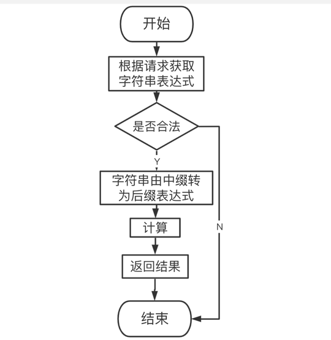

#### 1、整体框架
整体功能的实现思路
计算器的主要思路是获取请求中的字符串，对字符串进行校验，符合规范则对字符串转换为后缀表达式。利用栈，遇到数字入栈，遇到算数符号进行优先级比较，最后返回后缀表达式。根据后缀表达式进行计算

#### 2、目录结构
```
.
├── README.md
├── __pycache__
│   └── locustfile.cpython-39.pyc
├── app
│   └── main.go
├── go.mod
├── go.sum
├── internal
│   ├── ctrl
│   │   └── calculationCtrl.go
│   ├── router
│   │   └── calculationRouter.go
│   ├── service
│   │   ├── calculationService.go
│   │   └── calculationService_test.go
│   ├── status
│   │   └── ginResult.go
│   ├── test
│   │   ├── locustFile.py
│   │   └── 压测报告.html
│   └── utils
│       ├── calculate.go
│       ├── infixToPostfix.go
│       ├── isLeg.go
│       ├── judgePpriority.go
│       └── stack.go
└── 流程图.png


```

#### 3. 代码逻辑分层


|层|文件夹|主要职责|调用关系|其他说明|
| ------------ | ------------ | ------------ | ------------ | ------------ |
|应用层 |app/http/main.go  |服务器启动 |调用路由层  |不可同层调用
|路由层 |internal/router/CalculationRouter.go  |路由转发 | 调用控制层 被应用层   |不可同层调用
|控制层 |internal/ctrl/CalculationCtrl.go |请求参数处理，响应 | 调用handler层 被路由层调用    |不可同层调用
|handler层 |internal/handler/Calculation.go  |处理具体业务 | 调用路由层service层，被控制层调用    |不可同层调用
|service层   |internal/service/CalculationService.go  |处理业务逻辑 | 调用工具层，被handler层调用    |可同层调用
| 结构体 |internal/structInfo/ginResult.go  |统一异常处理 | 被service，控制层调用   |不可同层调用
| 工具类 |utils  |处理、计算表达式 | 被service层调用   |可同层调用

#### 4. 存储结构

使用字符串临时存储的表达式，使用栈对字符进行临时存储

#### 5. 接口设计

http get

| 接口地址  |  请求参数 |  响应参数|
   | ------------ | ------------ | ------------ |
|  http://127.0.0.1:8080/CalculationCtrl |  str="1+2*3+(4*5+6)*7" |  {"code":200,"msg":"OK","data":189}|

响应状态码

|状态码|  说明 |
| ------------ | ------------ |
| 200  | 成功  |
| 1001  |  字符串不能为空 |
| 1002 |   字符串不合法|
| 1003  | 除数不能为零  |


#### 6. 如何编译执行

`
go build
`

`
./app
`

#### 7、todo

继续优化代码，增加% ^ 等运算符计算

#### 8. 流程图



